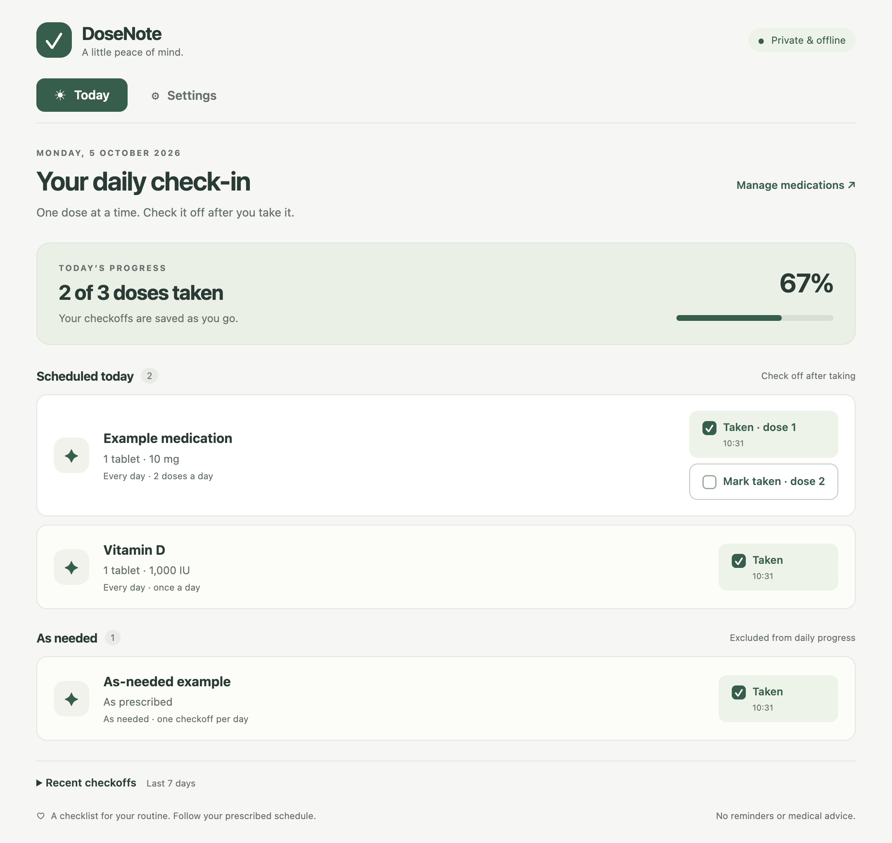
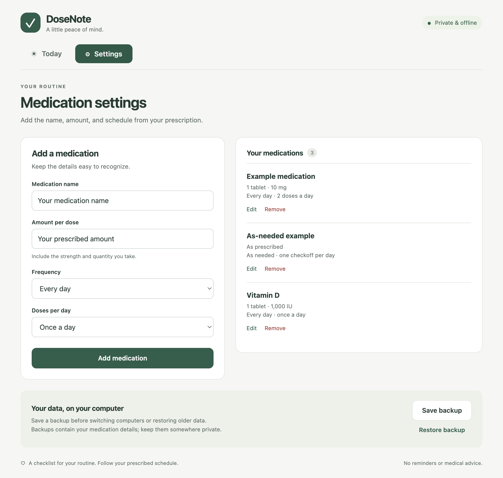

# DoseNote

A simple, private desktop app for answering “Did I take my medication today?” Add your medications in **Settings**, then check off each dose on **Today**. Your checkoffs are saved automatically on your computer.

No accounts, subscriptions, internet connection, or command line needed to use the downloaded app.



## Install

Open this repository’s **Releases** page and download the file for your computer. Download the app installer, rather than GitHub’s automatic “Source code” ZIP.

| Computer | Download | Installation |
| --- | --- | --- |
| Mac with Apple silicon (M1 or newer) | `DoseNote-…-mac-arm64.dmg` | Open the disk image, drag DoseNote into Applications, then launch it from Applications or Spotlight. |
| Mac with an Intel processor | `DoseNote-…-mac-x64.dmg` | Open the disk image and drag DoseNote into Applications. |
| Windows 10/11, 64-bit | `DoseNote-…-win-x64.exe` | Double-click the installer and follow its steps. Open DoseNote from Start or its desktop shortcut. |
| Linux, 64-bit | `DoseNote-…-linux-x64.AppImage` | Open Properties → Permissions, allow running as a program, then double-click. |

On Mac, **Apple menu → About This Mac** shows whether you have an Apple chip or Intel processor. Current builds require macOS 13 or newer, following [Electron’s platform requirements](https://releases.electronjs.org/release/v44.0.0). Linux AppImage support depends on your distribution, including its FUSE support; see the [AppImage FUSE guide](https://docs.appimage.org/user-guide/troubleshooting/fuse.html) if your system cannot open it.

**Release status:** This project includes a workflow that builds the downloads when its owner publishes a version tag. Until those builds are uploaded to a release, there are no public downloads. Local unsigned Mac builds are intended for testing; signing and notarization are needed for a smooth public Mac installation. Unsigned Windows builds may show a publisher warning. See [Publishing releases](docs/RELEASING.md).

## Use

1. Open **Settings**. Enter the medication name and amount **per dose**, including the strength and quantity (for example, “1 tablet · 10 mg”).
2. Choose **Every day**, **Selected days of the week**, or **As needed**. For scheduled medications, choose the number of doses per day; for selected days, also tick the weekdays. Click **Add medication**.
3. Open **Today**. After taking a dose, click **Mark as taken** (or the corresponding numbered dose). The button shows its recorded time.
4. If you checked something by mistake, click its **Taken** button to undo it. Each dose is independent.

The checklist starts fresh each local calendar day. Past checkoffs remain saved; expand **Recent checkoffs** to view the last seven days. All saved history is included in backups. Edits affect the current routine immediately, while recorded doses keep their original medication details. Removing a medication keeps its past checkoffs.

**As needed** allows one reversible checkoff per medication per day, outside daily progress. It does not log repeated as-needed doses or calculate safe dosing intervals. Frequencies such as every other day, every eight hours, tapering schedules, and specific administration times are not supported. Use the app only when its schedule options match your prescribed routine.



Screenshots use fictional example data; amounts shown are not recommendations.

## Privacy and backups

DoseNote works offline. It sends no medication data, analytics, or telemetry. Data is stored as an unencrypted JSON file in your computer’s user profile. Anyone with access to that file or an exported backup can read it; use your computer’s login and disk encryption for privacy. This is a local checklist, with no cloud sync or shared caregiver view.

In **Settings**, choose **Save backup** to create a JSON backup. Copy that file to a private location. On another computer, install DoseNote and choose **Restore backup**. Restoring asks for confirmation and **replaces** the current medication list and history.

Typical data-file locations:

- macOS: `~/Library/Application Support/DoseNote/medications.json`
- Windows: `%APPDATA%\DoseNote\medications.json`
- Linux: `~/.config/DoseNote/medications.json` (or the location selected by `XDG_CONFIG_HOME`)

If saved data is damaged, the app shows an error and leaves the file untouched. Close DoseNote and copy the file somewhere safe before recovery. To recover from a known-good backup, move the damaged file out of the data folder, reopen the app, and restore your backup from Settings.

## Important limits

DoseNote records what you check off. It cannot verify that medication was taken and does not provide alarms, clinical advice, missed-dose instructions, or overdose protection. Follow your prescription and ask your pharmacist or clinician about changes or missed doses. Closing the app does not lose saved checkoffs.

## For developers

Install Node.js 22 or newer, then run:

```sh
npm ci
npm start
```

Build an installer on its matching operating system:

```sh
npm run dist:mac
npm run dist:win
npm run dist:linux
```

Built files go into `dist/`. These commands are for developers; people using the released app do not need Node.js or Python.

```sh
npm test       # schedule, checkoff, history, validation, and disk-storage tests
npm run test:ui # launches the real Electron app with isolated temporary data
```

The UI test covers add/edit/remove, multiple doses, undo, saved checkoffs after relaunch, selected-day validation, safe rendering, backup export, and confirmed restore. It updates README screenshots using fictional data. On headless Linux, run it with `xvfb-run -a npm run test:ui`. Linux CI launches the test process with `--no-sandbox` for runner compatibility; normal downloaded apps retain their sandbox configuration.

Built with Electron and plain HTML/CSS/JavaScript. The renderer is sandboxed with context isolation, a restricted preload API, and no network access. Medication data is validated in the main process and written via a temporary file and rename. Single-instance locking prevents two open copies from overwriting each other’s checkoffs.

See [release instructions](docs/RELEASING.md) for GitHub setup, installers, and signing. Licensed under [MIT](LICENSE).
